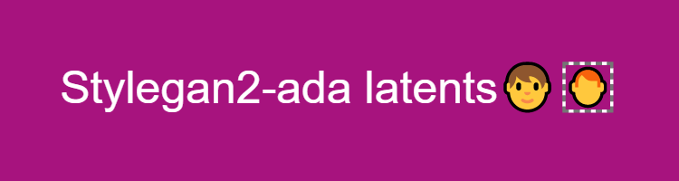
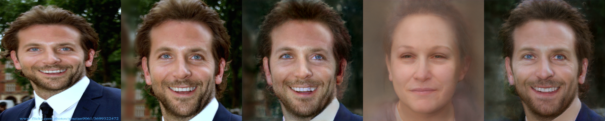
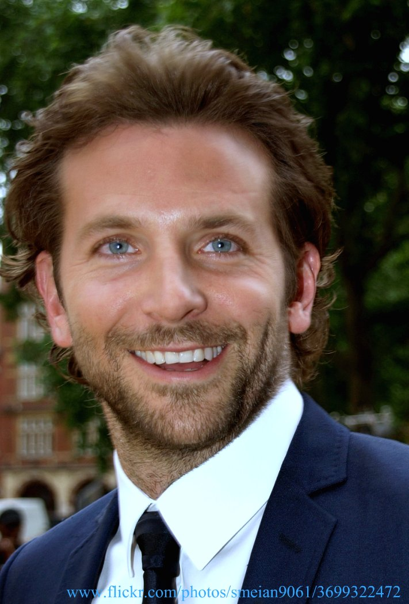
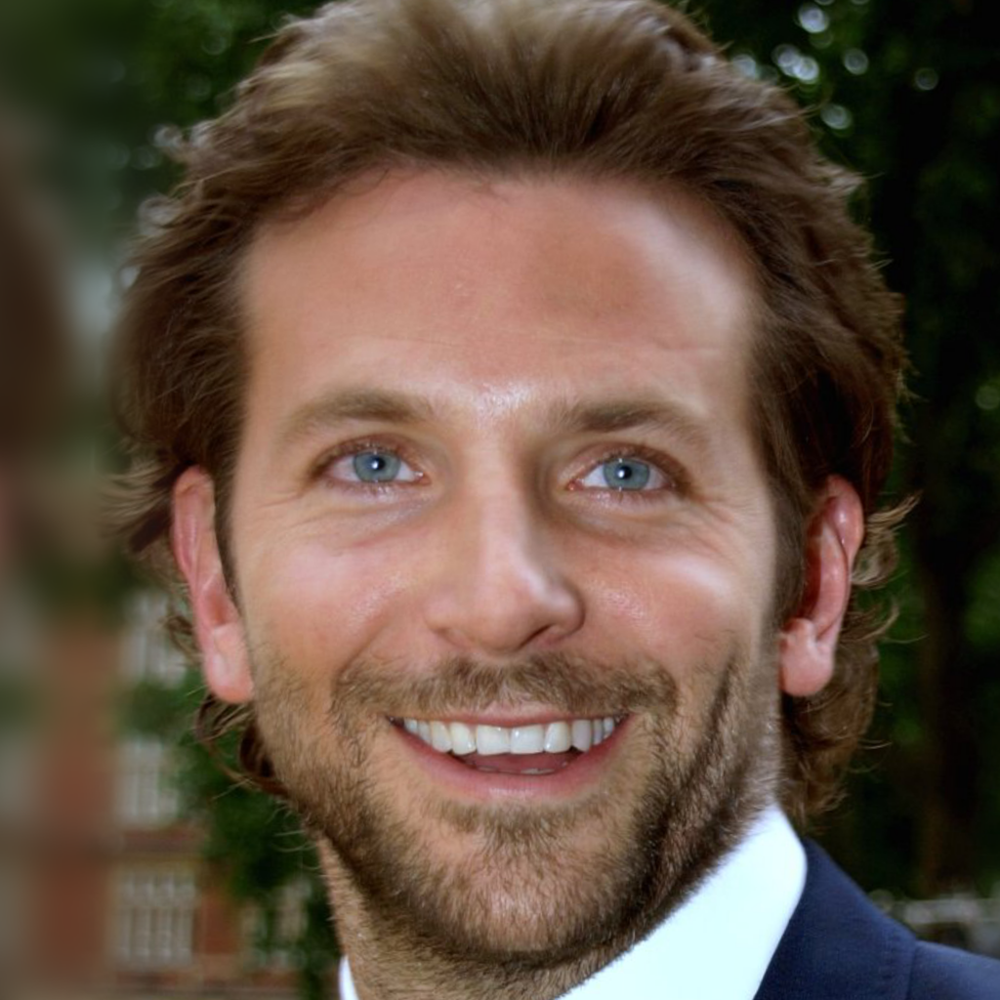
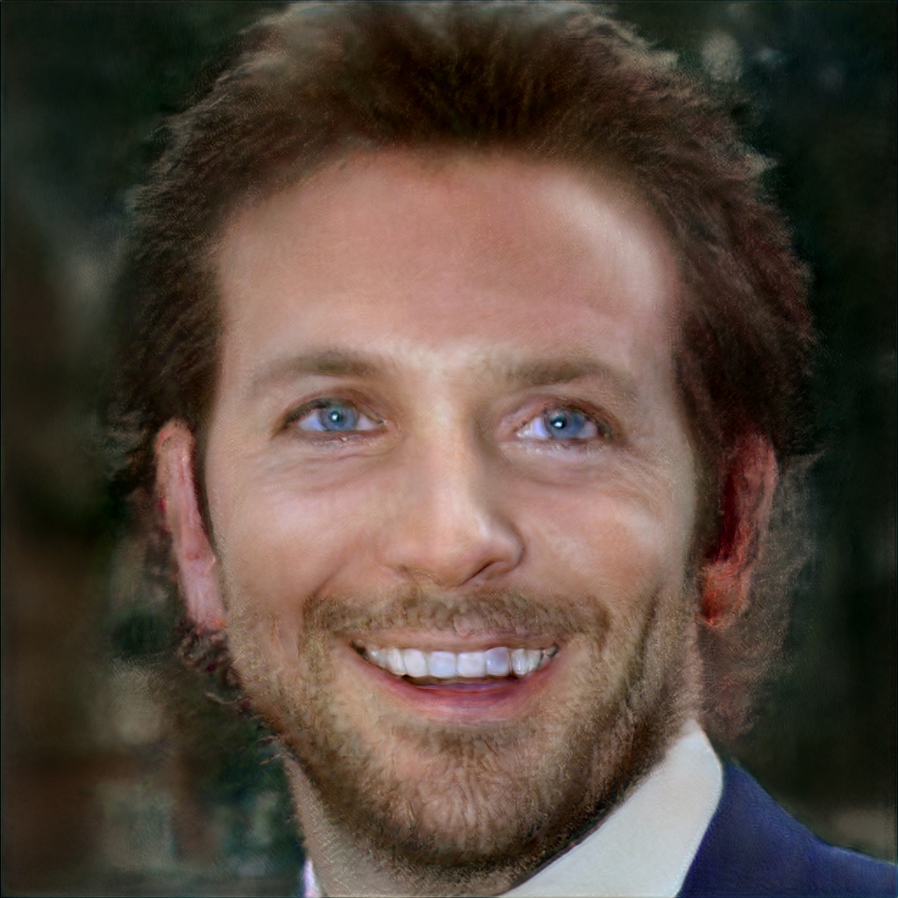
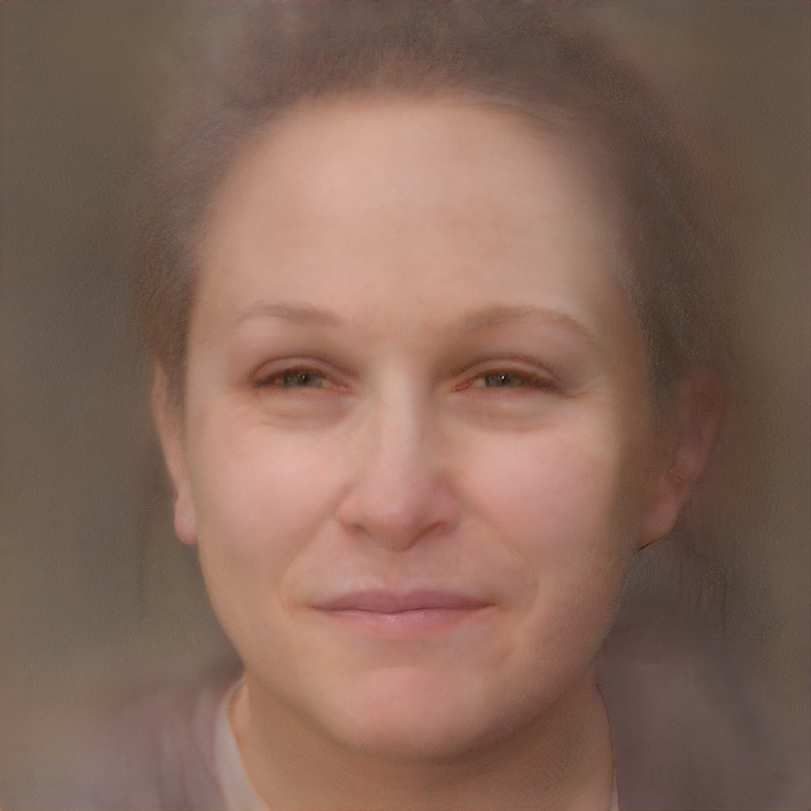
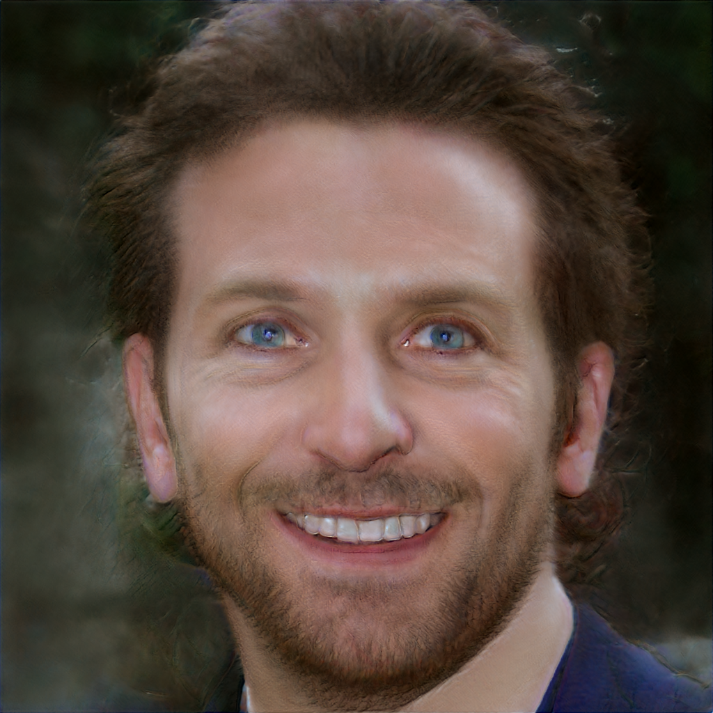

# Image2StyleGAN implementation

## Pipeline
```bash
1. Aligned Image
2. Preprocess
3. Find latent vector with encoder
4. Find exact latent by optimize it using gradient descent
```

## Encoder
```
Encoder extract features via modified Resnet-50
Loss was only MSE, ppl need to be added
```

0. ### Column


1. ### Image


2. ### Aligned


3. ### Only Gradient descent result (from 0-vector)


4. ### Encoder latent


5. ### Encoder + Gradient descent



With latent vectors you can make a lot of transformation, look at my other repo!

https://github.com/DFGANDP/CelebA-VAE-feature-extractor

# References:
https://arxiv.org/abs/1904.03189

http://www.seeprettyface.com/research_notes.html

https://github.com/zaidbhat1234/Image2StyleGAN

https://github.com/AmarSaini/Epoching_StyleGan2_Setup
